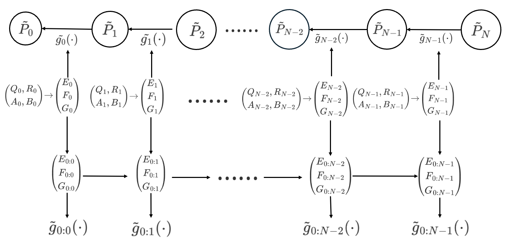
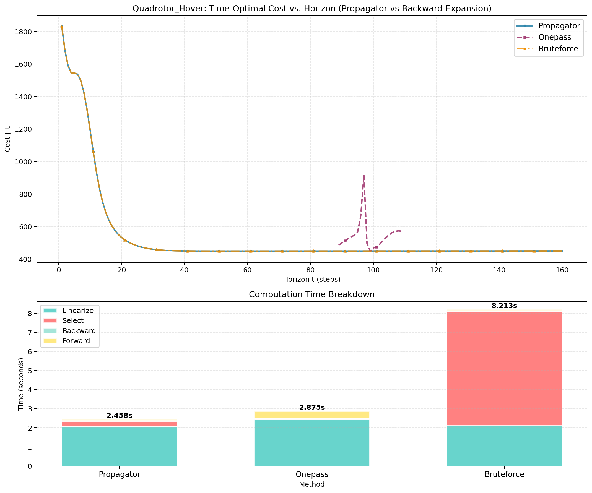

# Fast Differential Dynamic Programming for Time-Optimal Trajectory Planning

Time-optimal trajectory planning—generating motions that complete a task in the minimum possible time—is a fundamental requirement for agile robotic systems. This repository implements an efficient algorithm for jointly optimizing the control sequence and the total maneuver duration $T$ using iterative Linear Quadratic Regulator (iLQR).

## Problem Statement

We consider the discrete-time optimal control problem with variable horizon:

$$\min_{U_T, T} \quad J = \phi(x_T) + \sum_{k=0}^{T-1} \ell(x_k, u_k) + wT$$

subject to:
- $x_{k+1} = f(x_k, u_k)$, for $k = 0, \ldots, T-1$
- $x_0 = \bar{x}_0$
- $T \in \{1, 2, \ldots, N\}$

The term $wT$ penalizes the planning horizon, encouraging time-optimal behaviour of the system.

## Key Challenge

A fundamental bottleneck in standard approaches lies in the structure of the standard Riccati recursion. In the LQR backward pass, the Value Function $V_k$ is computed recursively starting from a terminal cost anchored at the final time step $T$. Consequently, changing the horizon from $T$ to $T+1$ shifts the boundary condition, invalidating the entire sequence of previously computed Cost-to-Go matrices. This structural dependency prevents the reuse of historical computations across different horizons, forcing the solver to restart the backward pass from scratch for each candidate $T$, resulting in a prohibitive $\mathcal{O}(N^2)$ complexity.

## Our Approach: Time-Varying Propagator

To address the loss of reusability in time-varying systems, we shift from *reusing values* to *reusing mappings*.



**Figure: Time-varying propagator.** When $g_k$ varies with $k$, we switch to inverse form where each stage is an LFT $\tilde{g}_k$. The composed map $\tilde{g}_{0:k}$ remains an LFT with prefix parameters $(E_{0:k}, F_{0:k}, G_{0:k})$. This enables cheap horizon queries by reusing the composed mapping $\tilde{g}_{0:k}$ instead of reusing $\tilde{P}_k$ values.

Our key idea is to rewrite the map $g_k$ as a new linear fractional transformation (LFT) form $\tilde{g}_{0:k}$, and some of the matrices that help compute $\tilde{g}_{0:k}$ can be reused. As a result, these matrices only need to be computed once for all possible horizons $k=1,2,\cdots,N$, as opposed to be repetitively computed for each possible horizon, which thus saves computational effort.

### Main Contributions

1. **Propagator-based Horizon Selection:** We develop an LFT-based solver that enables the reuse of backward pass computations, reducing the complexity of horizon selection from $\mathcal{O}(N^2n^3)$ to $\mathcal{O}(Nn^3)$.

2. **Augmented State Formulation:** We propose a state augmentation technique that embeds affine linearization terms into a homogeneous coordinate system, extending the efficient propagator method to general nonlinear iLQR problems.

3. **Performance and Robustness:** We validate our algorithm on four benchmark systems, including a 12-DOF Quadrotor. Experimental results show that our method achieves speedups of up to **43x** compared to brute-force search while guaranteeing global optimality with respect to the linearized model.

## Experimental Results



**Figure: Case Study on Quadrotor Hover.** (Top) Comparison of cost landscapes ($J_t$) computed by different methods. (Bottom) Breakdown of total runtime into linearization, selection, backward, and forward phases.

**Cost Landscape (Top):** The OnePass method (Purple) approximates the cost landscape by projecting the value function from a single nominal horizon. This approximation suffers from severe distortions when the system dynamics vary significantly over time. Our Propagator curve (Blue) overlaps perfectly with the Bruteforce markers (Yellow), confirming that our augmented formulation correctly captures the exact time-varying LQR cost.

**Runtime Breakdown (Bottom):** The inefficiency of the Bruteforce method is evident in the massive "Select" phase, representing the $\mathcal{O}(N^2)$ cost of repeated Riccati sweeps. Our Propagator method eliminates this bottleneck by compressing the horizon evaluation into an $\mathcal{O}(N)$ LFT propagation.

## Benchmark Systems

- Double Integrator
- Segway Balance
- Cartpole Swing-Up
- 12-DOF Quadrotor

## Run Benchmarks

```bash
python run_suite.py --outdir ilqr_results --trials 25 --max-iter 12
```

Run only specific cases:
```bash
python run_suite.py --outdir ilqr_results --cases Quadrotor,Segway_Balance --trials 10
```

## Generate Plots

```bash
python plot.py --outdir ilqr_results
```
