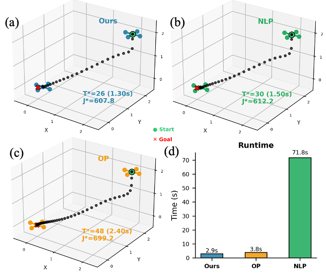
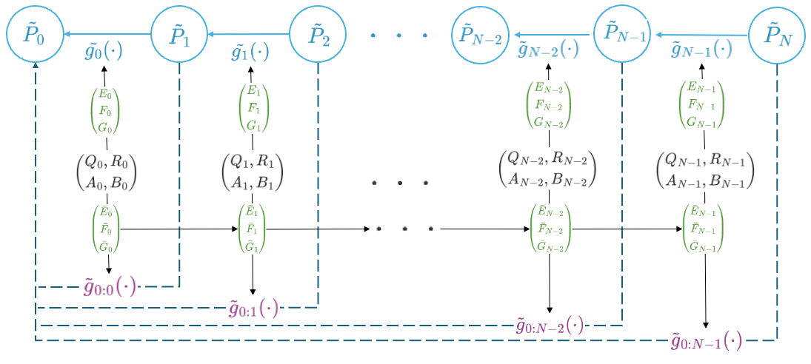
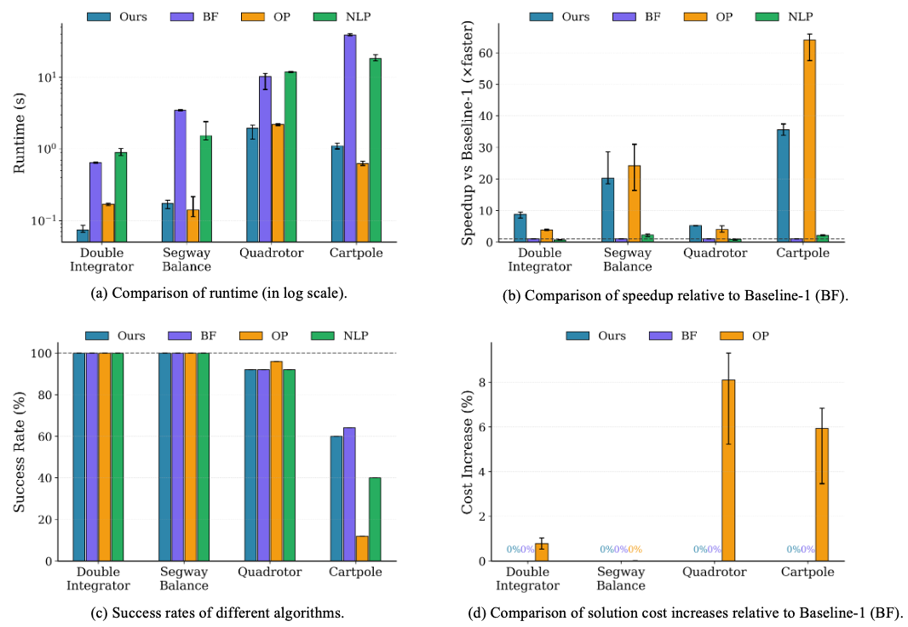
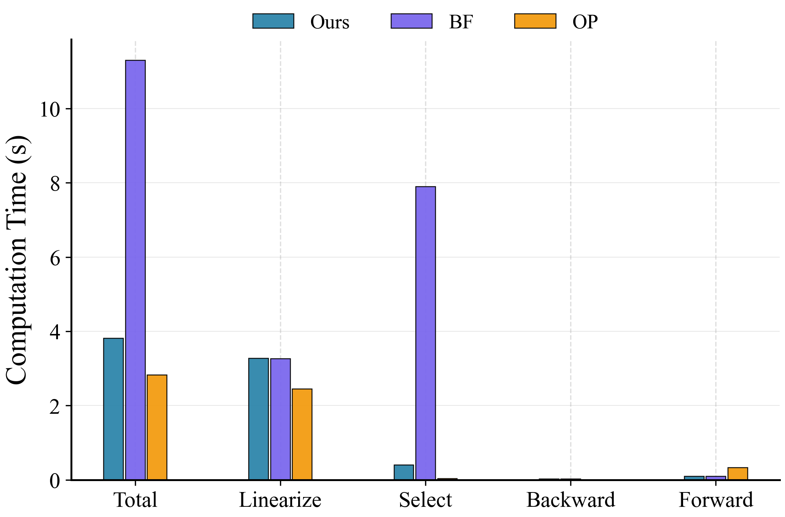

# HOP: Fast Differential Dynamic Programming for Horizon-Optimal Trajectory Planning

This repository implements **HOP (Horizon-Optimal Planning)**, a novel algorithm for horizon-optimal trajectory planning. HOP seeks a dynamically feasible trajectory while minimizing the planning horizon, which is a fundamental problem in robotics with numerous applications such as drone racing and agile flight.

## Problem Statement

We consider the Horizon-Optimal Control problem with variable horizon:

$$\min_{U_T, T} \quad J = \phi(x_T) + \sum_{k=0}^{T-1} \ell(x_k, u_k) + wT$$

subject to:
- $x_{k+1} = f(x_k, u_k)$, for $k = 0, \ldots, T-1$
- $x_0 = \bar{x}_0$
- $T \in \{1, 2, \ldots, N\}$

The term $wT$ penalizes the planning horizon, encouraging time-optimal behaviour of the system.

## Key Challenge

The standard Riccati recursion computes the Value Function $V_k$ backwards from the terminal time step $T$. Changing the horizon invalidates all previously computed Cost-to-Go matrices, forcing the solver to restart from scratch for each candidate horizon. This results in prohibitive $\mathcal{O}(N^2 n^3)$ complexity.

## Our Approach: Linear Fractional Transformation (LFT)



**Figure: Quadrotor Results.** For a quadrotor dynamics with 12 degrees of freedom, our HOP-DDP finds the best solution trajectory with horizon $T^* = 26$ in 2.9 seconds while the DDP based on time-invariant LQR (OP) and NLP converges to local minima $T^* = 48, 30$ in 3.8 and 71.8 seconds respectively.

The key insight in HOP is that the Riccati recursion can be reformulated into a form of **Linear Fractional Transformation (LFT)**, which enables efficient computational reuse even for non-stationary dynamics and costs.



**Figure: HOP-LQR Algorithm.** The system matrices are used to compute matrices $(E_k, F_k, G_k)$ and $(\bar{E}_k, \bar{F}_k, \bar{G}_k)$. The composed maps $\tilde{g}_{0:k}(\cdot)$ enable direct evaluation of the inverse of initial cost-to-go for any horizon $k$.

### Main Contributions

1. **HOP-LQR Algorithm:** We develop an LFT-based solver that enables the reuse of backward pass computations, reducing the complexity of horizon selection from $\mathcal{O}(N^2n^3)$ to $\mathcal{O}(Nn^3)$.

2. **HOP-DDP Algorithm:** We propose an augmented state space formulation that embeds affine linearization terms into a homogeneous coordinate system, allowing horizon-optimal control with general nonlinear dynamics and non-quadratic costs.

3. **Performance:** Our approach always finds the same optimal solution as a naive brute force baseline method, while running up to **40× faster**. For nonlinear dynamics, our method always finds better solutions than approximation using time-invariant LQR.

## Experimental Results



**Figure: Overall Performance.** (a) Runtime comparison in log scale. (b) Speedup relative to Brute Force baseline. (c) Success rates of different algorithms. (d) Solution cost increases relative to Brute Force baseline. Our method finds solutions of better quality than OP and NLP, while enjoying fast running speed.

### Case Study: Quadrotor Hovering


**Figure: Cost values for various horizons.** Our method and Baseline-1 (BF) both find optimal horizon $T^* = 32$ with costs $J_{32}^{ours} \approx 484.79$, $J_{32}^{BF} \approx 484.80$, while Baseline-2 (OP) converges to a local minimum with longer horizon ($T \approx 74$) and 5.97% higher cost.



**Figure: Runtime breakdown.** Ours and Baseline-2 (OP) run faster than Baseline-1 (BF) as they bypass the expensive computation for horizon selection.

## Benchmark Systems

- Double Integrator
- Segway Balance
- Cartpole Swing-Up
- 12-DOF Quadrotor

## Run Benchmarks

```bash
python run_suite.py --outdir ilqr_results --trials 25 --max-iter 12
```

Run only specific cases:
```bash
python run_suite.py --outdir ilqr_results --cases Quadrotor,Segway_Balance --trials 10
```

## Generate Plots

```bash
python plot.py --outdir ilqr_results
```

## References

- Anderson, B. D. O. and Moore, J. B. (1990). *Optimal Control: Linear Quadratic Methods*. Prentice Hall.
- Li, W. and Todorov, E. (2004). Iterative linear quadratic regulator design for nonlinear biological movement systems. *ICINCO*.
- Stachowicz, K. and Theodorou, E. A. (2021). Optimal-horizon model-predictive control with differential dynamic programming.
